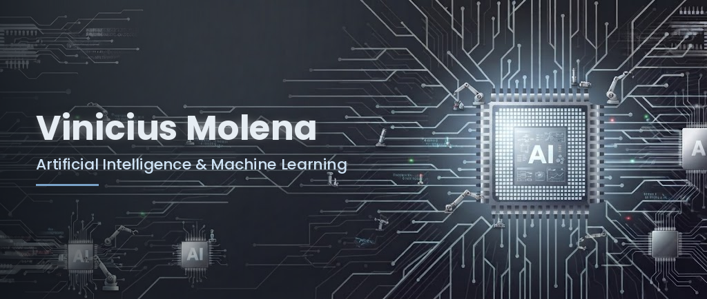
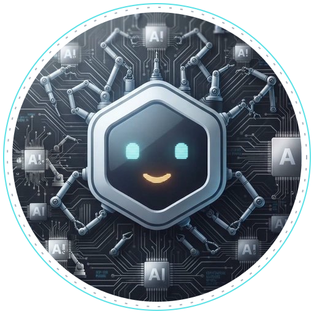

  

<h2 align="center">Sobre mim</h2>

<table align="center">
  <tr>
    <td width="36%" align="center" valign="middle">
      
    </td>
    <td width="64%" valign="middle">
      <h3>Olá! Sou o Vinicius 👋</h3>
      Sou apaixonado por <b>Inteligência Artificial</b> e por como ela pode <b>automatizar tarefas e processos</b> do dia a dia.
        
      🤖 &nbsp;IA generativa, LLMs e agentes 
      ⚙️ &nbsp;Automação de processos com IA 
      📊 &nbsp;Machine Learning e análise de dados 
      🌱 &nbsp;Sempre aprendendo algo novo
    </td>
  </tr>
</table>

<h2 align="center">Tecnologias</h2>

  

<h2 align="center">Contato</h2>

  
  &nbsp;&nbsp;
  

