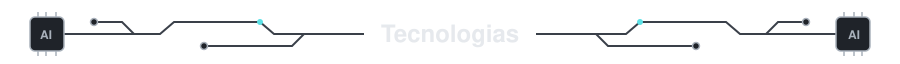
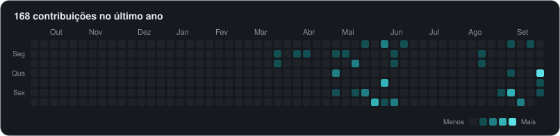
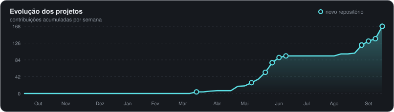

  

<table align="center">
  <tr>
    <td width="36%" align="center" valign="middle">
      
    </td>
    <td width="64%" valign="middle">
       
      <h3>Olá! Sou o Vinicius</h3>
      Acredito que a <b>Inteligência Artificial</b> mostra seu verdadeiro valor quando sai da teoria e resolve problemas reais.
      Por isso, meu foco e interesse é no que a <b>IA, ML e automação</b> possibilitam para criar soluções que aprendem, se adaptam e trabalham junto com as pessoas,
      tirando do caminho o que é repetitivo e abrindo espaço para o que é criativo.
        
       &nbsp;IA generativa, LLMs e agentes inteligentes  
       &nbsp;Automação de processos com IA  
       &nbsp;Machine Learning e análise de dados  
       &nbsp;Aprendizado e estudo constante
       &nbsp;Curiosidade constante por novas ferramentas
        
    </td>
  </tr>
</table>

  Os projetos dos meus repositórios foram desenvolvidos para atividades da faculdade.

  

  

  

  
  &nbsp;
  

